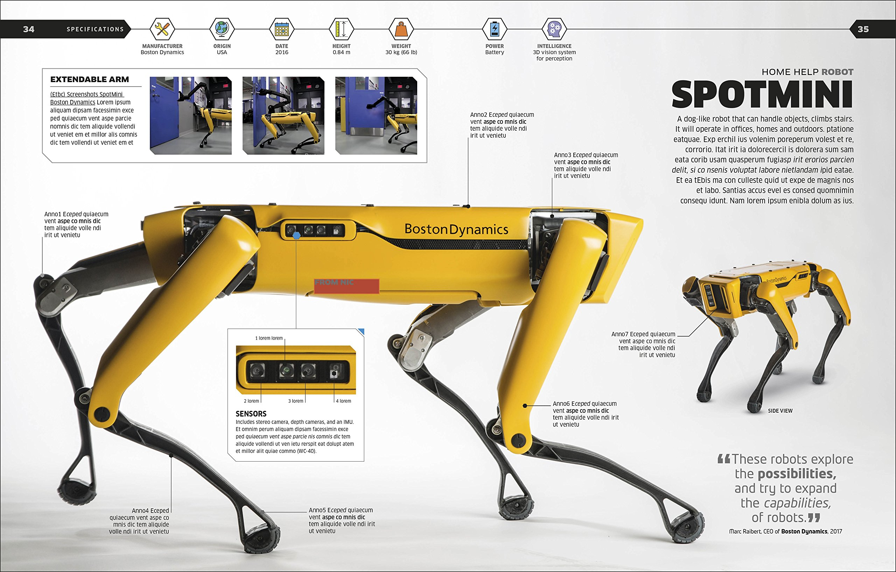
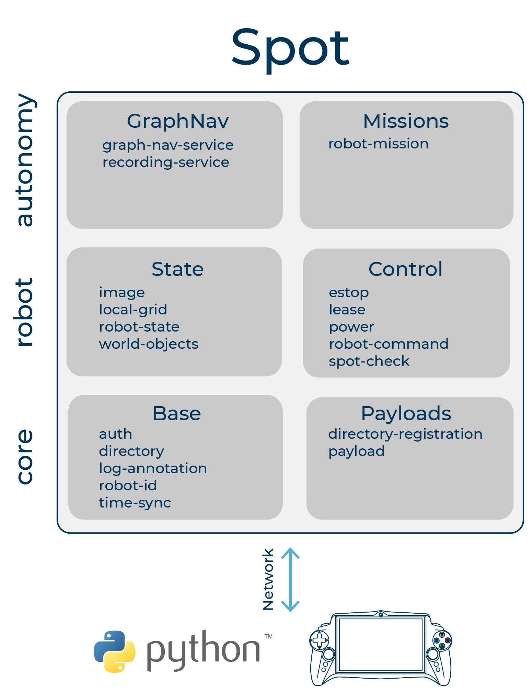
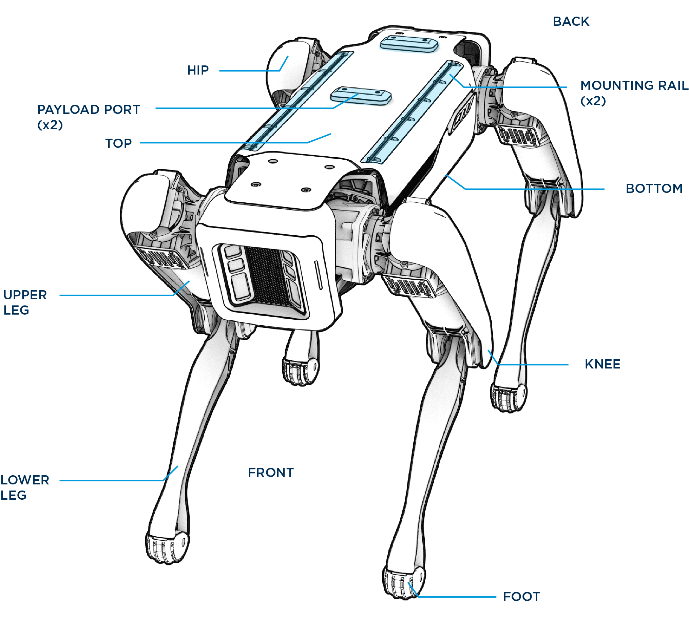
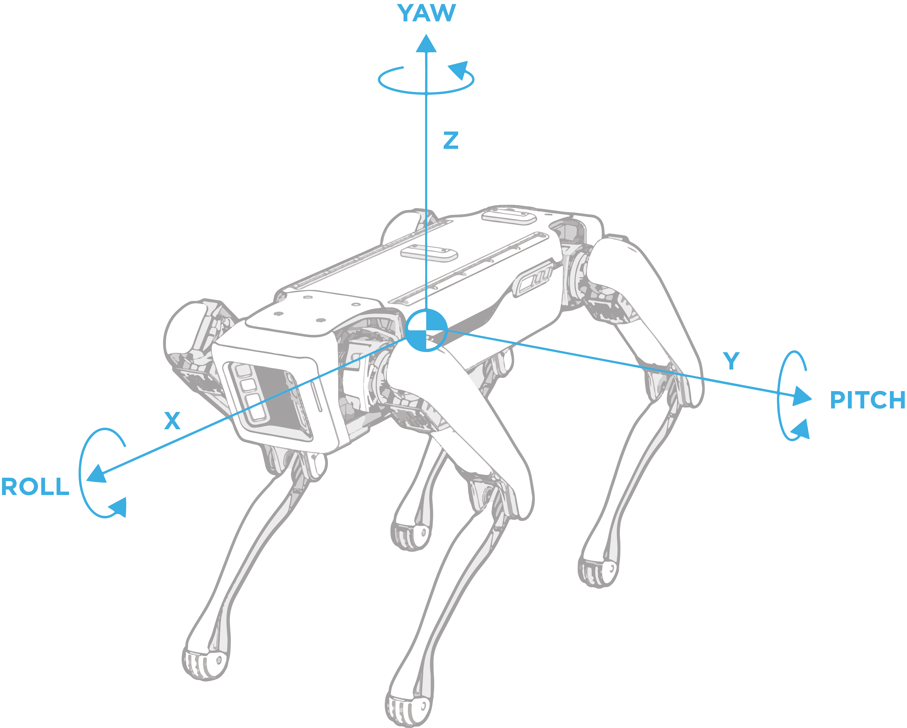
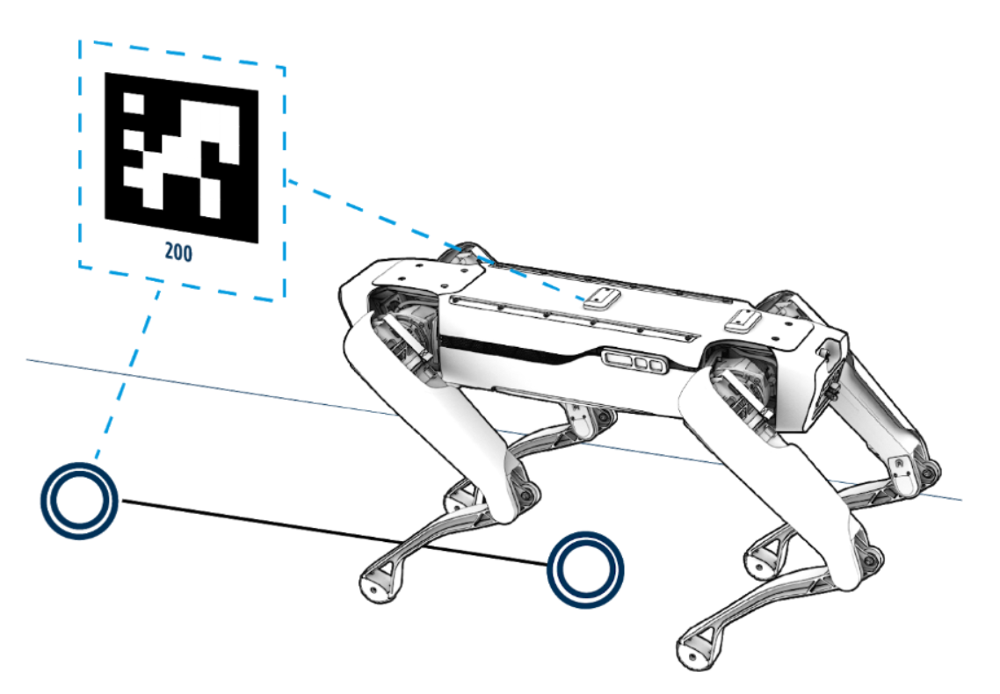
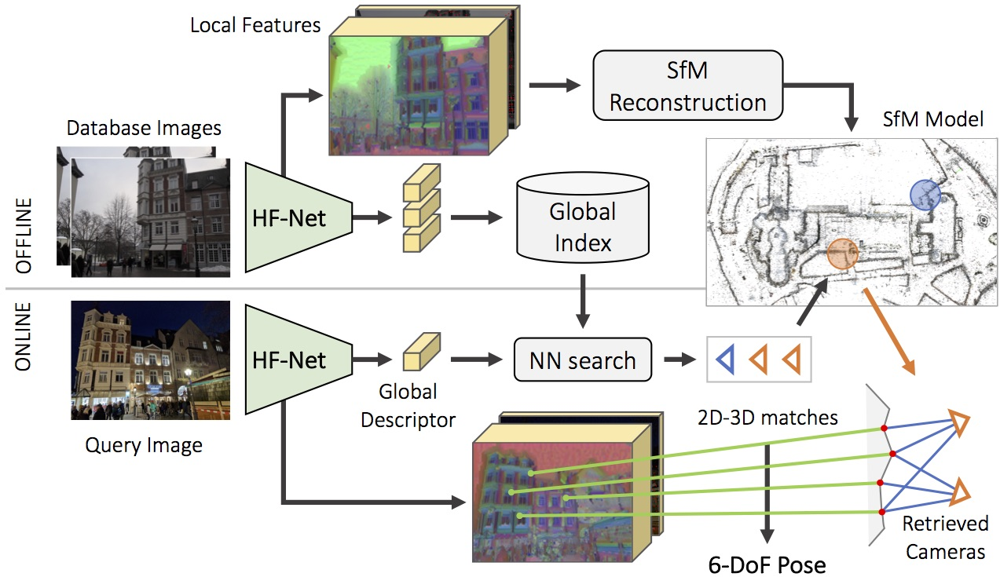
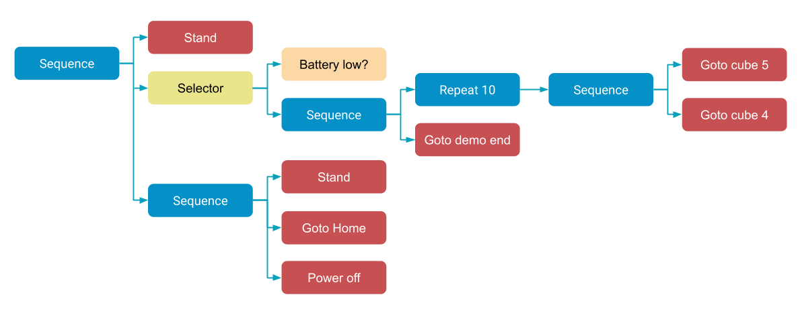

# Spot 机器人介绍

[Boston Dynamics](https://www.bostondynamics.com)

* Marc Raibert
* Zachary Jackowski
* Russell Tedrake

## Spot 设计理念

* 5 个**立体灰度相机** \(Projected Stereo, D430?\)
* 12 个**自由度**，每条腿 3 个自由度 \(HX HY KN\)

## gRPC and Protocol Buffers

TODO

## 底层服务

* robot-id
* auth
* directory
* time-sync

## 几何与坐标系

* Inertial frames
* The robot's body frame
* Sensor frames
* Object frames

## 机器人服务

* **estop**
* power
* robot-command
* robot-state
* image
* **local-grid**
* world-object

## 自主导航服务 \(GraphNav, Missions API\)

**Autowalk** App

Teach-Repeat/**Record\(a Map\)**-Replay

**拓扑地图** \(Topological Graph\) **Graph = Waypoints + Edges, Waypoint 的作用等效于视觉 SLAM 中的关键帧**。

**Waypoints + Edges 的快照内容**

* Waypoint - 特征点，点云，AprilTag，图像，地面信息
* Edge - 两端点 Waypoint 之间的位姿变换，长度约为 2m，有无阶梯

Spot 自主导航未采用全局地图，Replay 阶段的地图不作更新。

总结：**Map** = **Graph + waypoint\_snapshots** + **edge\_snapshots**

💡用 Waypoints 附近的局部地图作视觉重定位 \(相对于某个 Waypoint 进行局部定位\)，具体参考 HF-Net。

### Mission 服务

**行为树 \(**Behavior trees**\)**

| Structural Nodes | Description |
| :--- | :--- |
| **Sequence** | Specify a list of actions for the robot to perform. Sequences can be nested or combined with other structural node types. |
| **Selector** | Selectors run their child nodes in order until one of them succeeds. |
| Repeat | Loop a subtree a certain number of times. |
| Retry | Loop a subtree until it succeeds. |
| ForDuration | Loop a subtree until it fails. |
| SimpleParallel | Execute two nodes or subtrees at the same time. |

| Action Nodes \(叶节点\) | Description |
| :--- | :--- |
| Condition | Express a binary comparison operation that returns true if the condition is true and false otherwise. |
| BosdynRobotState | Query robot service names, host, child nodes, battery, comms, E-Stop, kinematic and other robot system states. |
| BosdynRobotCommand | Issue a command to a robot to stop, freeze, self right, sit, stand, power off safely, go to a destination, or walk with some velocity. |
| BosdynPowerRequest | Power the robot on or off. |
| BosdynNavigateTo | Autonomously move the robot. Includes parameters for controlling properties, such as speed. |
| BosdynGraphNavState | Request the mission service to save graph nav state to the blackboard, where it can be accessed by a Condition node. |
| RemoteGrpc | Customize the behavior of missions. Example: trigger a remote sensor payload to take a reading during an autonomous mission. |
| Sleep | Sleep for a specified number of seconds. |
| Prompt | Prompt a supervisor with a question, such as "Is it safe to cross the street?" The supervisor can be a robot operator responding to a UI prompt or an automated process running anywhere that can communicate with the robot. |
| SpotCamStoreMedia | Issue a request to write images to the Spot CAM USB stick. Note that an installed Spot CAM payload is required and the USB stick must be inserted before booting the robot. |
| DefineBlackboard | Specify a blackboard variable for this node's children to use. |
| SetBlackboard | Write to a blackboard variable. The variable must have already been defined. |
| ConstantResult | Always return one of the standard status codes \(SUCCESS, RUNNING, or FAILURE\). |

## References

[波士顿动力 Spot 开箱概略](https://zhuanlan.zhihu.com/p/146362311)

[Spot SDK](https://github.com/boston-dynamics/spot-sdk)

[HF-Net: Robust Hierarchical Localization at Large Scale](https://github.com/ethz-asl/hfnet)

